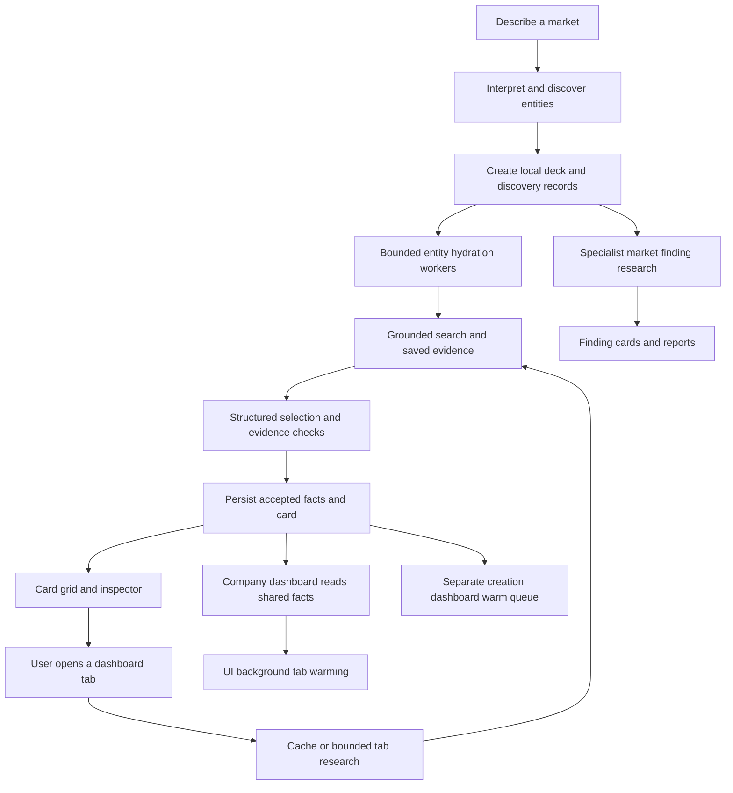

# Stratemark / Keystone — GLM and Z Code handoff

> Preservation update: read [verified Z Code transfer state](ZCODE-TRANSFER-VERIFIED.md) first. The interrupted edits have now been committed as WIP in `3ad3d92` and pushed to the dated migration branch, with the remote hash verified. The uncommitted/missing-backup descriptions below record the earlier stop state; the testing limitations and open questions still apply.
Updated 2026-10-06. This is the current migration entry point and recovery sequence.
Implementation was interrupted at the owner's request to conserve usage. This document records observations, hypotheses and proposed work separately. It does not certify beta readiness.

## 1. Read this before building

1. Read this document, then `AGENTS.md`.
2. Read `docs/KEYSTONE-BACKEND-RECOVERY-AUDIT-2026-10-06.md` for the preceding live evidence and regression history.
3. Inspect `git status --short`, the current branch and the actual diff. The working tree contains unfinished changes.
4. Use the older architecture/design documents for intent, not proof of implementation. Their checkpoint counts and branch names can be stale.
5. Reproduce one customer-visible failure and trace its evidence through the whole pipeline before selecting a repair.

The owner wants a fresh technical assessment. Challenge inherited assumptions. Do not turn an unresolved explanation in this document into a confirmed root cause.

## 2. Product intent and constraints

Stratemark is a local-first market and company intelligence workspace. A market is a collectible deck; a card is the entrance to useful, organized research.

- Entity cards: Company, Infrastructure and Distribution. Each opens an inspector and a full company dashboard.
- Finding cards: Insight, Culture, Vice and Barrier to Entry. Each needs a concise original finding, an expanded explanation, a substantial readable report, attached sources and contextual chat. These do not borrow company metrics or use company comparison/ranking indiscriminately.
- The owner likes the current collectible-card aesthetic. Preserve its proportions, hero logo, typography direction, restrained physical shading and company brand treatment. Repair readability and behavior with targeted changes.
- Entity fronts share name, location, employees, revenue/ARR, users/customers and valuation/market cap. These measurements must retain their actual meaning: annual revenue is not ARR; product subscribers are not company customers; funding raised is not valuation.
- Unknown is null, never fabricated zero. A missing figure may mean absent disclosure, failed retrieval, failed extraction or rejected/conflicting evidence. Determine which.
- Research remains local and reopenable. No key extraction, key logging, secret commits or external upload of user research.
- Current working provider is Gemini with Google grounding. Provider flexibility is an eventual requirement: separate synthesis, search/retrieval and image capabilities. No promise that every provider/key can supply all three.
- Long-term roles: Deck Sentinel coordinates discovery, assignments, verification and cohort ranking; Card Scout owns each entity's research and assets; specialists research market findings. Persistent identities, durable jobs, schedules and cancellation require explicit implementation and acceptance. Function/class names alone do not establish this.
- Recurring Scouts must run bounded scheduled jobs, respect pause/cancel/budgets and show outcomes. They must not retry forever.
- MCP should eventually expose clear local actions and scoped data to other agents, including Muse/OpenAI integrations where supported. This is downstream of a reliable core research journey.
- Do not promise sign-in with OpenAI can spend ChatGPT subscription credits in a third-party app; capability/terms require separate current verification.

## 3. Exact repository and backup state

Local repository:
`C:/Users/shann/Documents/Codex/2026-09-28/i-x20/work/stratemark-card-redesign-revival`

Active branch:
`revival/keystone-grounded-backend-recovery-oct06`

Latest committed recovery:
`c51ee585cca2aa772e89955aac120dd7690d083a`
`fix: recover grounded research hydration and bounded dashboards`

Owner's remote:
`newsam = https://github.com/NewSamBellamy/STRATEMARK-latest--1.git`

Reference remotes:
- `origin = https://github.com/lYlarufAhmed/STRATEMARK-latest-`
- `tobi = https://github.com/squarepegng/STRATEMARK-app.git`

The current recovery branch's GitHub backup is NOT confirmed. Prior pushes stalled; the preceding remote-head check returned no matching branch. Do not assume cloning GitHub recovers this machine's newest work.

The owner intends to switch to API credits, then publish a migration checkpoint to their separate branch, then continue in Z Code with GLM. At this handoff no new push was attempted. Never push/merge main, force-push, overwrite existing remote work or publish credentials.

### Before moving machines or relying on a clone

- Inspect remotes and exact commit. Preserve all local modifications.
- Review and save unfinished edits in a clearly labeled WIP commit or equivalent recoverable patch before copying/cloning. A docs-only commit does not include them.
- Verify the new remote branch resolves to the saved commit after pushing; command dispatch is not backup confirmation.
- This may be a linked worktree; its `.git` file can point outside the directory. Copying only the project folder may not copy repository history. Check with `git rev-parse --git-dir --git-common-dir`. Prefer a verified remote clone or a separately verified local bundle.
- Export research through the app's existing export tools if needed. Git contains code, not necessarily the browser's IndexedDB or native research database. Test the export's completeness before moving data. Keep research exports and credentials out of public GitHub.
- The Gemini key remains configured in the existing app. Do not copy it through chat, logs, commits or handoff text.
- Earlier Git object inspection reported orphan index/garbage warnings. The cause of the stalled push is unknown. Diagnose before repair; do not delete objects or run destructive cleanup.

## 4. What is actually established

The preceding committed recovery made the following changes. See its audit for detailed evidence.

- Completed cards can appear while a deck is still building; discovery placeholders are retained but excluded from the finished-card grid.
- Initial entity hydration uses one grounded search and one structured extraction before persistence/publication; original-page verification no longer blocks that first snapshot.
- Google per-claim attribution is retained separately from original-page verification. Source-reported observations do not receive fake verified status.
- Shared evidence projection checks identity, numeric value, measurement, reporting date and attribution. Some clean omitted observations can be recovered from paid, retained research without a second API call.
- Native originals and browser saved evidence can be read for projection/reopen. Dashboard cache compatibility and company scoping received repairs.
- Dashboard requests have a 90-second lifetime with late-write protection/in-flight deduplication. UI automatic retries were disabled for dashboard calls.
- A guarded development-only loopback Gemini relay restored provider connectivity in the in-app preview. It is not a shipped production connector.
- A public two-company live run reached cards in roughly 64 seconds. The final committed preview showed Microsoft employees/revenue/market cap and NVIDIA employees/revenue/market cap; customer counts remained unknown.
- A full Frontier AI market run discovered 28 entities, first completed cards around 117 seconds and full run roughly five minutes. Numerous private-company facts and descriptions remained missing.
- Saved OpenAI evidence included company-profile, overview, team and Live Intel search output. Research existed even where the displayed result was empty.
- A reopened OpenAI overview displayed cited background, though readability remained poor. A successful live Team/Products journey was not established.
- Preceding workspace checks/builds passed, with one native/live test skipped and bundle warnings. Those results describe that commit, not the unfinished working tree or launch quality.

Live figures above are observations of provider/app output. They were not independently audited financial facts.

## 5. New audit evidence and today's unfinished edits

Owner recording:
`C:/Users/shann/Desktop/stratemark audit 1006 second audit.mp4`
Duration 5:49.90. Reviewed a local contact sheet sampled every 30 seconds across the recording; this is not a frame-by-frame or audio transcription review. The owner's accompanying written narration is the primary explanation of intent.

Local sheet:
`C:/Users/shann/Documents/Codex/2026-09-28/i-x20/outputs/second-audit-contact.jpg`
This is a local artifact, not a committed document or guaranteed portable path.

Visible audit sequence:
- 0:00–0:30: attractive cards, empty metrics and inspector figures.
- 1:00–1:30: raw-looking overview/search/source content.
- 2:00–3:00: tab loading and uneven dashboard content.
- Around 3:30–4:00: org information and funding information, with missing portraits.
- Around 5:00: finding reader/report.
- Around 5:30: comparison containing many unknowns.
Exact defect attribution needs the relevant original frame and live reproduction.

Current in-app preview also showed multiple companies with missing metrics/descriptions. OpenAI had 4.5K employees with three unknown headline slots. Mistral/Cohere and others had more figures. This does not prove the separate Chrome/browser workspace in the recording shares the same database.

### Uncommitted changes when implementation stopped

These seven files are unfinished. They must be reviewed, tested or explicitly discarded by the next builder; do not reset unrelated work.

1. `packages/research/src/gemini-timeout.test.ts`
   Two new tests: retries must consume quota; grounding and structuring on the same model must share quota. Implementation was NOT changed. These tests are intended to expose bugs; they have not been run successfully.

2. `packages/research/src/pipeline.test.ts`
   New test asserting deck creation does not automatically launch hidden dashboard work. Repository behavior was NOT changed. This test encodes one proposed scheduling choice, not a product decision already accepted or a completed repair. Reconsider the choice after inspection.

3. `packages/research/src/reported-metrics.ts`
4. `packages/research/src/reported-metrics.test.ts`
   Attempted recovery when a numeric proposal omits its evidence selector; attempted preservation of ambiguity when annual revenue and ARR share one passage. Agent reported an initial run with 48 pass/2 fail and an intermediate run with 73 pass across related files. The LATEST refinement was applied afterward and has NOT been tested/typechecked. Check literal typing of the definitions array, loop indentation and semantic correctness. No fresh live company acceptance.

5. `apps/web/src/features/dashboard/SavedResearchNotes.tsx`
6. `apps/web/src/features/dashboard/DashboardSources.tsx`
7. `apps/web/src/features/dashboard/tabs/OverviewTab.tsx`
   Draft readable Markdown/passages, visible source section and overview empty state. No tests, typecheck, lint or browser validation ran on these edits. Existing tests may expect the older dropdown/count text. Escaped-newline handling only addresses content with no real newline; mixed content remains unresolved. The draft does not prove the deeper overview-format issue is fixed.

The main agent's attempted focused test command failed before Vitest started with Windows EPERM creating a temporary file. This is an execution limitation, not a passing or failing behavior result.

Pre-existing excluded changes:
- `apps/desktop/vitest.config.ts` modified; preserve and investigate ownership separately.
- `.pnpm-store/` untracked; do not commit.
- `docs/KEYSTONE-CATEGORY-BASELINE.md` untracked; preserve.
No code commit was made for the interrupted pass. Subagents were instructed to stop edits and tests.

## 6. What we know versus what remains unknown

| Area | Observed/code evidence | Still to determine |
| --- | --- | --- |
| Metrics | Saved evidence can exist while values disappear; some literal recovery works | For each missing field: absent disclosure, search miss, extraction miss, invalid binding, conflict, persistence or UI cache? |
| Latency | Full observed run roughly five minutes; multiple provider stages and queues | Time per stage, queue wait, retries, storage, source reads and per-company distribution on current key |
| Quotas | Native setup supplies eight RPM; browser provider does not supply explicit RPM and raw client defaults are zero | Actual key/model quotas; observed 429 frequency; suitable configurable pacing and cross-window behavior |
| Retry pacing | Raw Gemini client acquires quota before the retry loop | Whether retries/shared-model configuration cause the observed delays; how to prove and repair without harming deadlines |
| Background work | Repository queues overview/team/live for up to eight companies; separate UI warming uses pause control | Exact contention/spend, cancellation ownership, native/browser differences, intended prefetch policy |
| Dashboards | Some cached output exists; source-gated Team/Products paths remain | Fresh accepted output and reopen behavior for every visible tab; whether synthesis, originals or gates fail |
| Assets | Logos are inconsistent and many portraits absent | URL selection, canonical identity, size/resolution, fetch errors, redirects, photo provenance and cache outcomes |
| Sources | Overview/notes can render raw/escaped content; diagnostics are hard to use | Origin of malformed text and safe readable rendering across all report/cache formats |
| Agent roles | Discovery, entity hydration, specialist and dashboard functions exist | Which assignments/jobs are durable, inspectable/resumable and actually scheduled versus role naming |
| Reports | Finding content exists but owner finds it thin | Full-report content depth, factual support, reader and PDF/export completeness |
| Deployment | Preview runs locally; dev relay exists | Real native installer/provider/source flow, production transport, migration/backup/recovery, cross-platform behavior |

Do not assume more agents, a larger concurrency number, stricter verification or a full backend swap will improve outcomes. Each can worsen latency/completeness. Measure first.

## 7. Understandable system map

Current simplified path, to verify against code:

The separate warm paths are observed code, not a recommended final architecture.

Desired properties, not a mandated implementation:
- One understandable owner for each job and a shared provider budget.
- First useful card and inspector prioritized; progressive visible progress.
- Company facts and their evidence stored once and projected consistently everywhere.
- Tab research reuses saved evidence where useful, and exposes bounded failure/retry.
- Searches, retrieval, synthesis and assets can use different capability adapters.
- Durable local jobs, controls and readable diagnostics support Sentinel/Scouts rather than merely labeling functions as agents.

## 8. Ordered recovery plan

### Phase 0 — Transfer a reproducible state
Review the unfinished diff. Preserve it clearly as WIP if publishing. Establish a runnable checkout, verify research backup/export separately and verify the remote commit. Start with a stable preview; avoid hot reload during timed live runs. Capture baseline before fixes.
Exit: the new builder can open the same code and identify every unfinished change without this chat.

### Phase 1 — Explain one missing metric end to end
Use an existing saved company profile first. Follow the field through grounded output/metadata, structured proposal, evidence validator, persisted observation, canonical projection, card, inspector and dashboard.
Record accepted/rejected reason and measurement/date/source. Redact credentials. Replay paid evidence in a deterministic fixture.
Exit: one reproducible failure, its cause and a behavioral regression test. Then repeat across a public company, a disclosed private company and a genuinely sparse small business.

### Phase 2 — Repair publication and research quality
Fix proven extraction/projection defects without fabricating data or weakening identity/date/basis checks. Preserve competing dated observations instead of silently mixing them.
Choose a clear policy for annual revenue versus ARR and user populations in a shared slot, supported by actual source meaning.
Distinguish source-reported, original passage checked and human confirmed. Define accurate missing-data explanations.
Exit: all publicly supported fields from each acceptance fixture reach card, inspector and dashboard identically, survive restart and retain source receipts. Genuine unavailable figures stay honestly unavailable.

### Phase 3 — Measure and coordinate throughput
Instrument safe stage timings and counts: discovery, first-company search/extraction, persistence, first publication, all entities, specialist work, individual tabs, retries/429s and queue wait.
Review creation warm queue, UI warm hook and living runtime together. Select one scheduling policy with foreground priority and bounded prefetch; test pause, resume, cancellation and failures.
Review quotas per actual model/key, retry pacing and same-model bucket sharing. Do not increase concurrency blindly. Inspect discovery coverage expansion before deciding whether discovery should stream.
Exit: measured before/after on the same small workload, fewer redundant calls, controls accurately reflected, no background queue bypass. No unsupported universal speed guarantee.

### Phase 4 — Complete the company dashboard journey
Start with Overview, Business Figures, Team/Org and Products. Then Live Intel, Metrics, Governance/History/remaining tabs.
For each: define visible purpose, data contract, evidence acceptance, caching/reopen, loading deadline, honest empty/error state and manual refresh.
Restore readable overview paragraphs; show a source title and useful passage without raw diagnostic bloat. Correct portraits only with identity-supported images; initials remain safer than the wrong person.
Exit: exercise every tab with actual provider research, save/reopen, confirm source links and distinguish true nondisclosure from failure. A mock-only pass is insufficient.

### Phase 5 — Assets and specialist report quality
Repair canonical company/domain/logo selection, resolution and fallbacks across multiple brands; retries bounded and observable. Preserve approved card style.
Finding fronts get concise meaningful titles/synopses; inspector expands rather than repeats; full report has substantial organized narrative and citations, share/export and contextual Ask.
Exit: one complete finding of each type and mixed-brand card examples tested at desktop/narrow widths.

### Phase 6 — Durable agents and production foundation
Compare implemented jobs/storage with original Sentinel/Scout/specialist intent before adding abstractions. Fill actual durability, schedules, source updates, job history and cancellation gaps.
Provider capability adapters and MCP reuse defined actions; unsupported capabilities are explicit. Inspect authentication, local credential handling, imported/shared data and connector scope.
Validate installer, first run, offline read, backup/restore/migration, error recovery and supported platforms. Handle signing/release distribution decisions separately.
Exit: written beta checklist with demonstrated core journeys and explicit remaining limitations. Do not label million-user scalability or universal provider coverage established from local tests.

## 9. Checkpoint and evidence rules

For each bounded slice record:
- Customer-visible failure and root cause evidence.
- Files/actions changed.
- Tests actually executed, with exact results; separately note skipped and blocked checks.
- Actual live result, timings and missing-data outcome.
- Cost/call count if measured; never guess spend.
- Remaining uncertainty, next task and commit/remote backup status.

Use focused tests for the defect, then relevant package checks; run required workspace checks before a ready checkpoint/PR. Current scripts include `pnpm check` and `pnpm --filter @mi/web build`. Windows permission failures can occur; do not count a command that failed to start as verification.

Prioritize completed customer journeys over more scaffolding. Stop after repeated failed hypotheses and reconsider the architecture, not another prompt paragraph. Preserve notes between sessions in this file's follow-up log or a linked scoped checkpoint. Compact context at milestone boundaries with commit, diff, evidence and next command.

No current hard latency target is proven achievable. Propose explicit targets after baseline measurement and validate them on actual quota tiers. No architecture can guarantee zero false facts; make attribution, uncertainty, correction and verification clear and testable.

## 10. Starter instruction for the next model

Read `docs/STRATEMARK-ZCODE-HANDOFF.md` and `AGENTS.md`. Inspect the actual branch, diff and latest audit. This is a recovery effort for an attractive but incomplete local-first BYOK research app. Preserve the approved card design. Begin with Phase 0, then trace one missing publicly supported company metric through the entire research-to-display flow using saved evidence before purchasing another search. Treat all interrupted edits as unverified. Independently evaluate the scheduling hypotheses and unfinished tests. Work in bounded visible slices, prove each improvement through the actual card/inspector/dashboard journey, save checkpoints on a separate branch, and maintain an honest record of what works, what fails and what remains unknown. Do not infer completion from old test totals or agent-role names.

## 11. Follow-up log

- 2026-10-06 (Z Code / GLM 5.3 Flash): migration checkpoint verified; WIP reconciled and its `reported-metrics` refinement verified after a typecheck repair; Phase 1 complete — the missing-metric root cause is CONFIRMED as the identity gate in `reportedMetricCitations` against catalog-style retained evidence (235/235 evidence-company metric rows null). See `docs/OCT06-ZCODE-PHASE1-METRIC-TRACE.md` for the trace, the regression pair, and the Phase 2 repair direction. The three WIP hypothesis tests (gemini quota ×2, hidden dashboard work ×1) fail against unmodified behavior and remain open Phase 3 defects.
